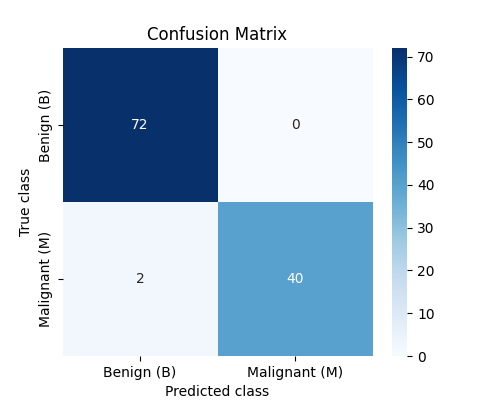
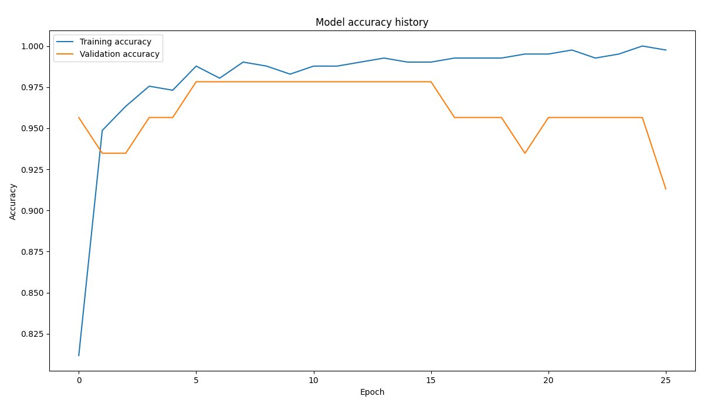
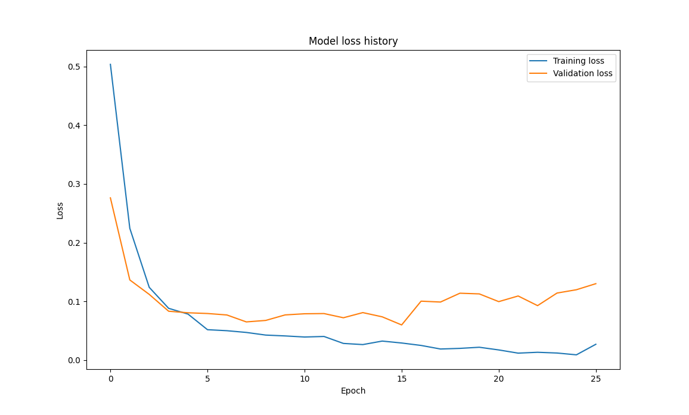

# Breast Cancer Classification using Deep Learning

## About the Project
This repository contains a Deep Learning project aimed at classifying breast cancer tumors as either **Benign (B)** or **Malignant (M)**. The core of the project is a fully connected Neural Network (Multi-Layer Perceptron) built using **TensorFlow and Keras**.

The pipeline handles everything from data loading and preprocessing to model training and evaluation. Key features of the architecture include:
* **StandardScaler:** Normalizes input features to ensure stable and fast convergence of the neural network.
* **Dropout Layers:** Used for regularization to prevent the model from overfitting to the training data.
* **Early Stopping:** A callback that monitors validation loss and automatically stops training when the model stops improving, restoring the optimal weights.

## Why the project is useful
Medical diagnosis is a critical field where high accuracy and low false-negative rates are paramount. This project demonstrates how Machine Learning and Deep Neural Networks can be effectively utilized to analyze medical datasets and assist in classifying tumors.

## Dataset Source
The data used in this project is the widely recognized **Breast Cancer Wisconsin (Diagnostic) Dataset**. The features are computed from a digitized image of a fine needle aspirate (FNA) of a breast mass, describing characteristics of the cell nuclei present in the image. 

You can find the original dataset and more information on [Kaggle](https://www.kaggle.com/datasets/uciml/breast-cancer-wisconsin-data).


## Technologies Used
- **Python 3.12.3**
- **TensorFlow / Keras** (Deep Learning framework)
- **Scikit-Learn** (Data preprocessing and metrics)
- **Pandas** (Dataframe manipulation)
- **NumPy** (Numerical operations)
- **Matplotlib & Seaborn** (Data visualization)


## How to Run the Project

1. **Clone the repository:**
   ```bash
   git clone https://github.com/zielantmagda/artificial-neural-network-bc.git

2. **Navigate to the project directory:**
   ```bash
   cd artificial-neural-network-bc

3. **Install the required dependencies:**
   ```bash
   pip install numpy pandas scikit-learn tensorflow matplotlib seaborn

4. **Run the algorithm:**
   
	Make sure the `breast_cancer.csv` dataset file is located in the same directory as the main script!
   ```bash
   python artificial-neural-network-bc.py

## Results & Visualizations
The model was evaluated on a test set, achieving excellent accuracy. The performance is documented through the following visualizations generated by the script:

### Confusion Matrix
The confusion matrix highlights the model's precision and recall, showing an extremely low number of misclassifications (false positives/negatives), which is crucial for medical data.




### Model Accuracy & Loss
The training history plots demonstrate healthy learning curves. The Early Stopping mechanism successfully prevented overfitting, as seen in the stabilization of the validation curves.






## Contact & Contribution
This project was developed as a part of my geospatial computer science studies and personal portfolio. If you have any questions or suggestions, feel free to contact me. 😊
